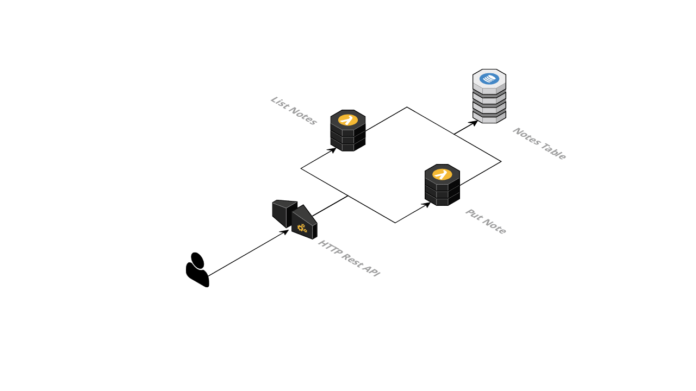

# cdk-hello-world

## Architecture Diagram



## Step-by-Step Guide

### Bootstrap

Let's get started by creating a completely new CDK stack.

1. Create a new folder: `mkdir cdk-hello-world`
1. Jump into the folder: `cd cdk-hello-world`
1. Init a CDK project: `npx cdk init app --language typescript`
1. Update CDK to latest version: `npm i @aws-cdk/core@latest @aws-cdk/assert@latest aws-cdk@latest`
1. Go to the file `bin/cdk-hello-world.ts` and add a prefix or suffix to the stack, e.g.:

   ```typescript
   #!/usr/bin/env node
   import "source-map-support/register";
   import * as cdk from "@aws-cdk/core";
   import { CdkHelloWorldStack } from "../lib/cdk-hello-world-stack";

   const app = new cdk.App();
   new CdkHelloWorldStack(app, "CdkHelloWorldStackHenrik");
   ```

1. Deploy stack: `npx cdk deploy`

**Questions:**

- Why did we add a prefix or suffix to the stack?
- What did we actually deploy?

### The first lambda function

Cool, we have a CDK stack now. Next step is our first Lambda function:

1. Create a new `src` folder: `mkdir src`
1. Create a new file: `touch src/putNote.ts`
1. Go to the file and add the following code:
   ```typescript
   export const handler = async () => {
     console.log("Hello World :)");
   };
   ```
1. Before we can describe the infrastructure, we need a new NPM package: `npm i @aws-cdk/aws-lambda-nodejs esbuild@0`
1. Next, update the file `lib/cdk-hello-world-stack.ts`:

   ```typescript
   import * as cdk from "@aws-cdk/core";
   import * as lambda from "@aws-cdk/aws-lambda-nodejs";

   export class CdkHelloWorldStack extends cdk.Stack {
     constructor(scope: cdk.Construct, id: string, props?: cdk.StackProps) {
       super(scope, id, props);

       new lambda.NodejsFunction(this, "PutNote", {
         entry: "src/putNote.ts",
         handler: "handler",
       });
     }
   }
   ```

1. Deploy the latest changes: `npx cdk deploy`

**Questions:**

- What resources did we create and why?
- How can you execute the Lambda function?
- How can you see the log output from the Lambda function?

### API Gateway

In this section we want to create a simple HTTP API to invoke the Lambda function:

1. Install the NPM package for API Gateway: `npm i @aws-cdk/aws-apigatewayv2 @aws-cdk/aws-apigatewayv2-integrations`
1. Update `lib/cdk-hello-world-stack.ts`:

   ```typescript
   import * as cdk from "@aws-cdk/core";
   import * as lambda from "@aws-cdk/aws-lambda-nodejs";
   import * as apigateway from "@aws-cdk/aws-apigatewayv2";
   import * as apigatewayIntegrations from "@aws-cdk/aws-apigatewayv2-integrations";

   export class CdkHelloWorldStack extends cdk.Stack {
     constructor(scope: cdk.Construct, id: string, props?: cdk.StackProps) {
       super(scope, id, props);

       const putNote = new lambda.NodejsFunction(this, "PutNote", {
         entry: "src/putNote.ts",
         handler: "handler",
       });

       const putNoteIntegration = new apigatewayIntegrations.LambdaProxyIntegration(
         {
           handler: putNote,
         }
       );

       const httpApi = new apigateway.HttpApi(this, "HttpApi");

       httpApi.addRoutes({
         path: "/notes",
         methods: [apigateway.HttpMethod.POST],
         integration: putNoteIntegration,
       });

       new cdk.CfnOutput(this, "URL", { value: httpApi.apiEndpoint });
     }
   }
   ```

1. Update the Lambda function, so `src/putNote.ts`:

   ```typescript
   export const handler = async () => {
     console.log("Hello World :)");

     return {
       statusCode: 200,
       body: JSON.stringify({ hello: "world" }),
     };
   };
   ```

1. Deploy: `npx cdk deploy`
1. Copy the endpoint URL from the output of the deployment and run the following request: `curl -X POST https://XXXXX.execute-api.eu-central-1.amazonaws.com/notes`

**Questions:**

- What is a CloudFormation output and where do I find it?
- How does the integration between API Gateway and Lambda work?
- What happens if I try to access routes I didn't configure?

### DynamoDB

We have an API and a lambda function. Pretty cool, now let's create a database and persist something:

1. As always, new dependencies: `npm i @aws-cdk/aws-dynamodb`
1. Plus more dependencies for our local setup: `npm i --save-dev aws-sdk @types/aws-lambda`
1. Extend our stack:

   ```typescript
   import * as cdk from "@aws-cdk/core";
   import * as lambda from "@aws-cdk/aws-lambda-nodejs";
   import * as apigateway from "@aws-cdk/aws-apigatewayv2";
   import * as apigatewayIntegrations from "@aws-cdk/aws-apigatewayv2-integrations";
   import * as dynamodb from "@aws-cdk/aws-dynamodb";

   export class CdkHelloWorldStack extends cdk.Stack {
     constructor(scope: cdk.Construct, id: string, props?: cdk.StackProps) {
       super(scope, id, props);

       const notesTable = new dynamodb.Table(this, "NotesTable", {
         partitionKey: { name: "id", type: dynamodb.AttributeType.STRING },
       });

       const putNote = new lambda.NodejsFunction(this, "PutNote", {
         entry: "src/putNote.ts",
         handler: "handler",
         environment: {
           TABLE_NAME: notesTable.tableName,
         },
       });

       notesTable.grant(putNote, "dynamodb:PutItem");

       const putNoteIntegration = new apigatewayIntegrations.LambdaProxyIntegration(
         {
           handler: putNote,
         }
       );

       const httpApi = new apigateway.HttpApi(this, "HttpApi");

       httpApi.addRoutes({
         path: "/notes",
         methods: [apigateway.HttpMethod.POST],
         integration: putNoteIntegration,
       });

       new cdk.CfnOutput(this, "URL", { value: httpApi.apiEndpoint });
     }
   }
   ```

1. Update the lambda function:

   ```typescript
   import * as AWS from "aws-sdk";
   import { APIGatewayProxyEvent } from "aws-lambda";

   const DB = new AWS.DynamoDB.DocumentClient();

   export const handler = async (event: APIGatewayProxyEvent) => {
     const body = JSON.parse(event.body || "{}");

     if (!body.title || !body.content) {
       return {
         statusCode: 400,
       };
     }

     await DB.put({
       Item: {
         id: new Date().toISOString(),
         title: body.title,
         content: body.content,
       },
       TableName: process.env.TABLE_NAME!,
     }).promise();

     return {
       statusCode: 201,
     };
   };
   ```

1. Deploy latest changes: `npx cdk deploy`
1. Run with your endpoint url: `curl -X POST https://XXXXXX.execute-api.eu-central-1.amazonaws.com/notes --data '{ "title": "Hello World", "content": "abc" }' -H 'Content-Type: application/json' -i`
1. Ideally, the first item should have been stored in the database.

**Questions:**

- Where can I find the environment variables of the Lambda function in the AWS console?
- What does the line `notesTable.grantReadWriteData(putNote)` do?
- Why do we just define the partition key for the table, but not the whole schema with the fields `title` and `content`?
- What is the maximum size of a note's content?

### Fetch list of notes

1. Extend the stack:

   ```typescript
   import * as cdk from "@aws-cdk/core";
   import * as lambda from "@aws-cdk/aws-lambda-nodejs";
   import * as apigateway from "@aws-cdk/aws-apigatewayv2";
   import * as apigatewayIntegrations from "@aws-cdk/aws-apigatewayv2-integrations";
   import * as dynamodb from "@aws-cdk/aws-dynamodb";

   export class CdkHelloWorldStack extends cdk.Stack {
     constructor(scope: cdk.Construct, id: string, props?: cdk.StackProps) {
       super(scope, id, props);

       const notesTable = new dynamodb.Table(this, "NotesTable", {
         partitionKey: { name: "id", type: dynamodb.AttributeType.STRING },
       });

       const putNote = new lambda.NodejsFunction(this, "PutNote", {
         entry: "src/putNote.ts",
         handler: "handler",
         environment: {
           TABLE_NAME: notesTable.tableName,
         },
       });

       const listNotes = new lambda.NodejsFunction(this, "ListNotes", {
         entry: "src/listNotes.ts",
         handler: "handler",
         environment: {
           TABLE_NAME: notesTable.tableName,
         },
       });

       notesTable.grant(putNote, "dynamodb:PutItem");
       notesTable.grant(listNotes, "dynamodb:Scan");

       const putNoteIntegration = new apigatewayIntegrations.LambdaProxyIntegration(
         {
           handler: putNote,
         }
       );

       const listNotesIntegration = new apigatewayIntegrations.LambdaProxyIntegration(
         {
           handler: listNotes,
         }
       );

       const httpApi = new apigateway.HttpApi(this, "HttpApi");

       httpApi.addRoutes({
         path: "/notes",
         methods: [apigateway.HttpMethod.POST],
         integration: putNoteIntegration,
       });

       httpApi.addRoutes({
         path: "/notes",
         methods: [apigateway.HttpMethod.GET],
         integration: listNotesIntegration,
       });

       new cdk.CfnOutput(this, "URL", { value: httpApi.apiEndpoint });
     }
   }
   ```

1. Create a new file: `touch src/listNotes.ts`:

   ```typescript
   import * as AWS from "aws-sdk";

   const DB = new AWS.DynamoDB.DocumentClient();

   export const handler = async () => {
     const response = await DB.scan({
       TableName: process.env.TABLE_NAME!,
     }).promise();

     return {
       statusCode: 200,
       body: JSON.stringify(response.Items),
     };
   };
   ```

1. Deploy: `npx cdk deploy`
1. Run the following request with your endpoint URL: `curl https://XXXXXX.execute-api.eu-central-1.amazonaws.com/notes`

**Questions:**

- How many notes are returned in the worst case?
- Why shouldn't we use scan operations here?

## Unit tests

In this section we are going to add some unit tests for the Lambda functions.

1. Delete the test file created by CDK: `rm test/cdk-hello-world.test.ts`
1. Create a new folder: `mkdir test/src`
1. Create a new file: `touch test/src/listNotes.test.ts`:

   ```typescript
   const scanSpy = jest.fn();
   jest.mock("aws-sdk", () => ({
     DynamoDB: {
       DocumentClient: jest.fn(() => ({
         scan: scanSpy,
       })),
     },
   }));

   import { handler } from "../../src/listNotes";

   beforeAll(() => {
     process.env.TABLE_NAME = "foo";
   });

   afterEach(() => {
     jest.resetAllMocks();
   });

   it("should return notes", async () => {
     const item = {
       id: "2021-04-12T18:55:06.295Z",
       title: "Hello World",
       content: "Minim nulla dolore nostrud dolor aliquip minim.",
     };

     scanSpy.mockImplementation(() => ({
       promise() {
         return Promise.resolve({ Items: [item] });
       },
     }));

     const response = await handler();

     expect(response).toEqual({
       statusCode: 200,
       body: JSON.stringify([item]),
     });
   });
   ```

1. Create a new file: `touch test/src/putNotes.test.ts`:

   ```typescript
   const putSpy = jest.fn();
   jest.mock("aws-sdk", () => ({
     DynamoDB: {
       DocumentClient: jest.fn(() => ({
         put: putSpy,
       })),
     },
   }));

   import { APIGatewayProxyEvent } from "aws-lambda";
   import { handler } from "../../src/putNote";

   beforeAll(() => {
     process.env.TABLE_NAME = "foo";
   });

   afterEach(() => {
     jest.resetAllMocks();
   });

   describe("valid request", () => {
     it("should return status code 201", async () => {
       const requestBody = {
         title: "Hello World",
         content: "Minim nulla dolore nostrud dolor aliquip minim.",
       };

       putSpy.mockImplementation(() => ({
         promise() {
           return Promise.resolve();
         },
       }));

       const event = {
         body: JSON.stringify(requestBody),
       } as APIGatewayProxyEvent;
       const response = await handler(event);

       expect(response).toEqual({
         statusCode: 201,
       });
     });
   });

   describe("invalid request body", () => {
     it("should return status code 400", async () => {
       const response = await handler({} as APIGatewayProxyEvent);

       expect(response).toEqual({
         statusCode: 400,
       });
     });
   });
   ```

1. Run the tests: `npm test`

## Further questions

- What is the request limit of our API?
- What are the costs per month for the provisioned infrastructure?
- Which anti-patterns do you see in this example project?

## What's next?

This is a list of ideas to extend the hello world example project:

- Add more routes
  - Get a note by id
  - Delete a note by id
  - Update a note by id
- Add pagination to the list of notes
- Add a DynamoDB Stream to process new items (e.g. count the words of the content and persist it in a new field of the item)
- Break the system and understand how to debug problems (e.g. What if we forget to pass the table name to the Lambda function?)
- Write unit tests for the Lambda functions
- Implement deployment strategies
- CI / CD Pipeline

## Links

- https://github.com/rakyll/hey
