# Create CodePipeline

To create a custom CodePipeline for your project, you need to fork this repository to your GitHub account.

## Create a new AWS CodePipeline project

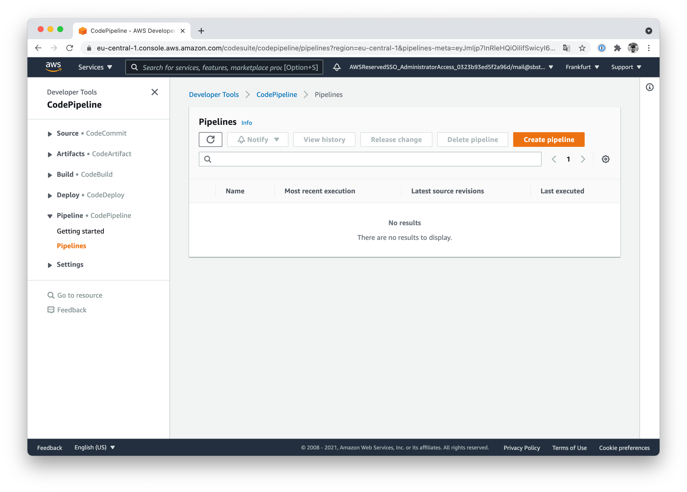

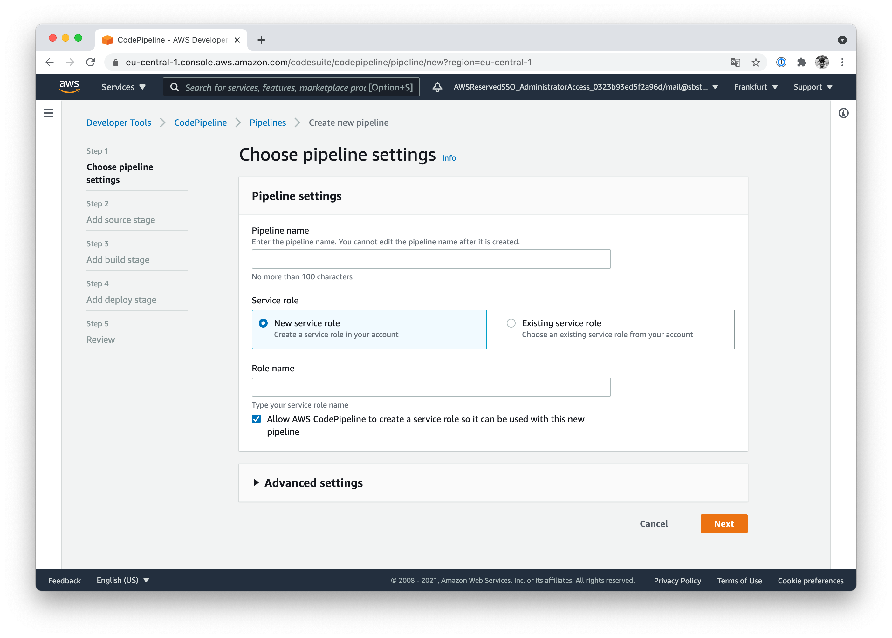

## Select GitHub (v2) as source provider

CodePipeline can access your GitHub repository after doing the initial _OAuth-Handshake_.

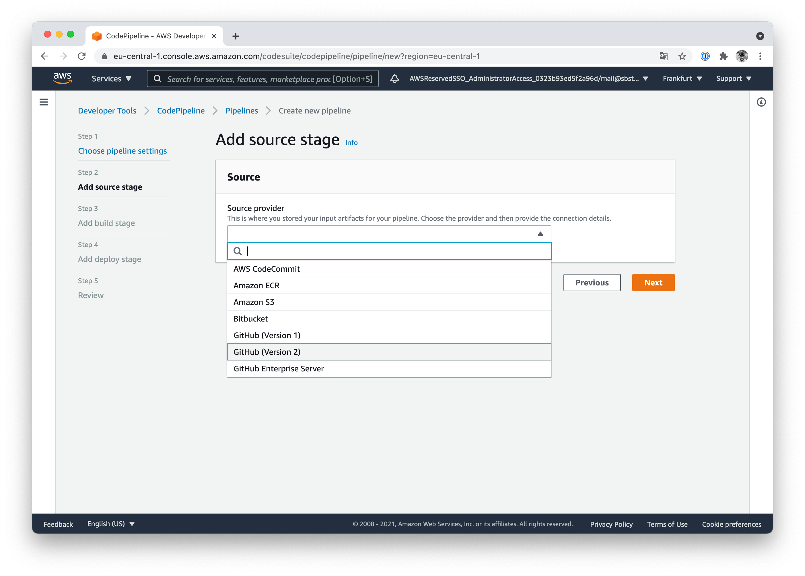

After granting CodePipeline access to your GitHub repositories, select the needed repository and configure the desired branch.

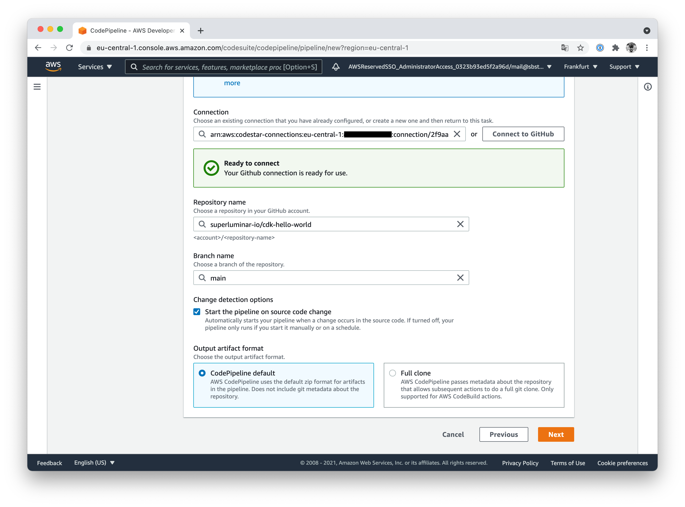

## Use CodeBuild to build the project

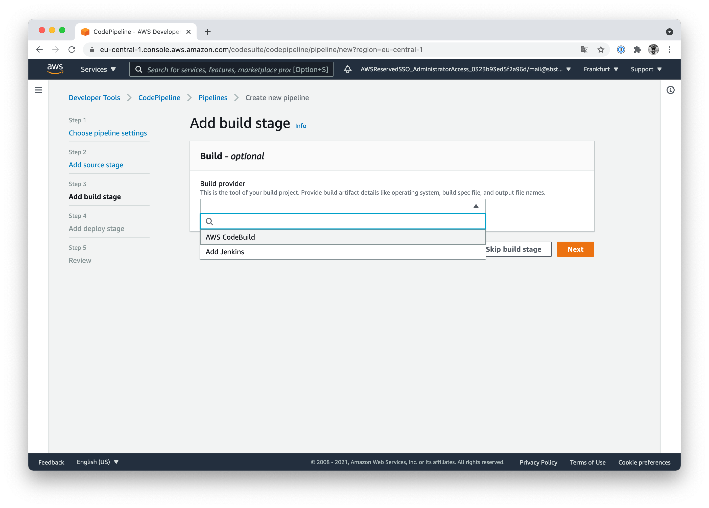

## Create a new CodeBuild project

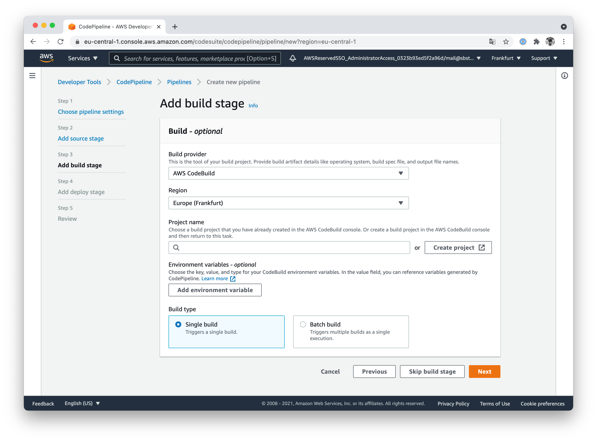

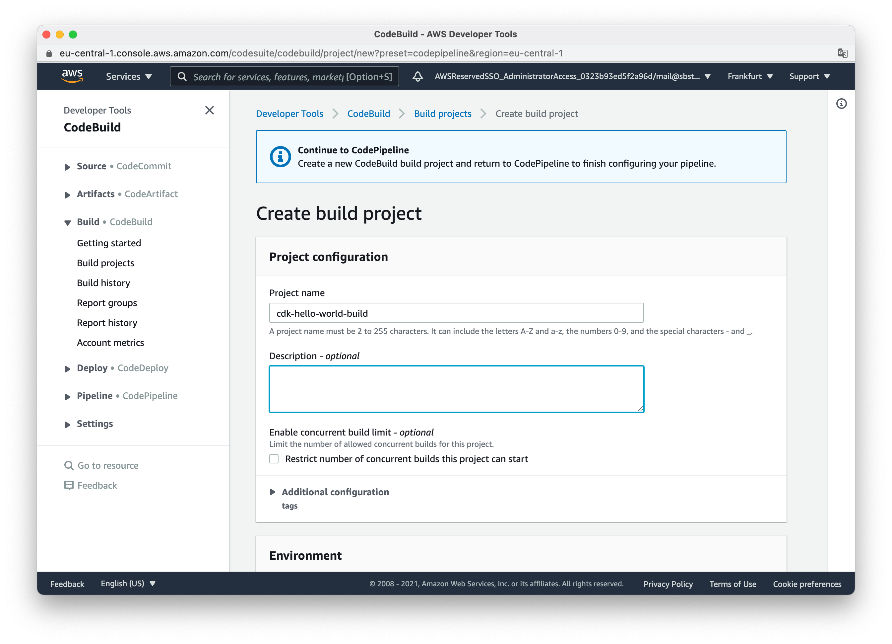

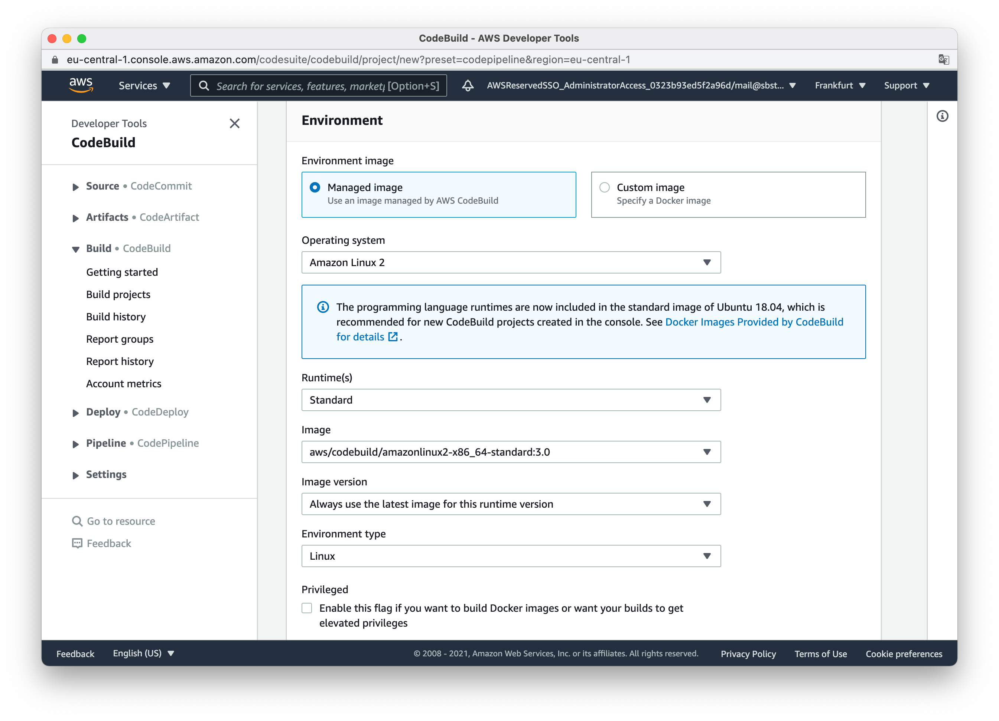

## Define Buildspec to run NPM commands

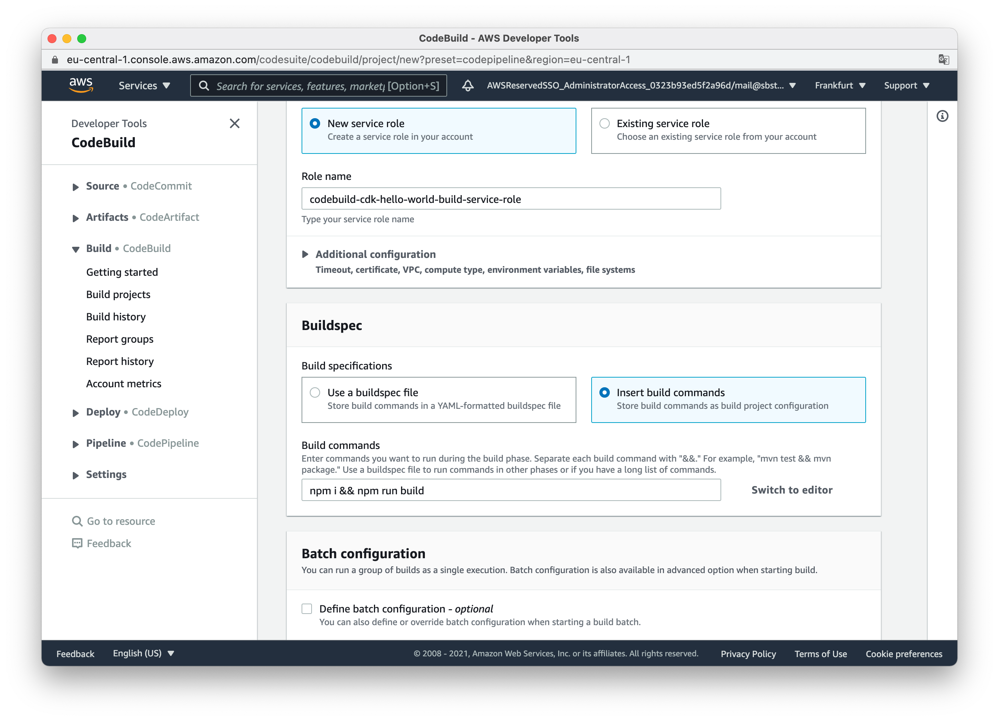

## Configure CodePipeline to use the CodeBuild project

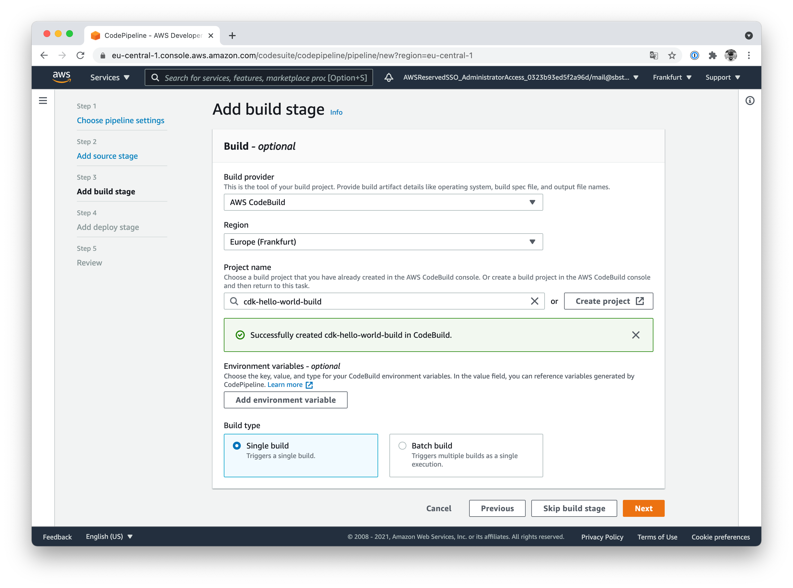

## Skip deploy stage

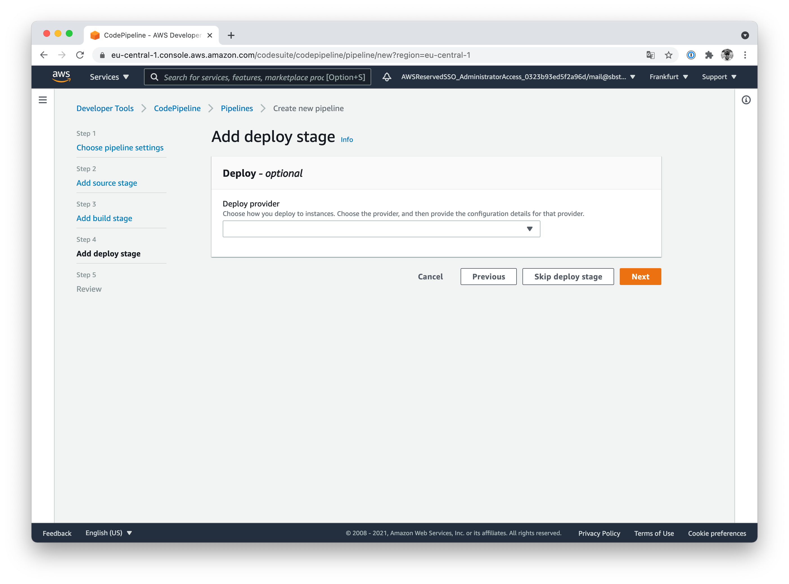

## Run your CodePipeline

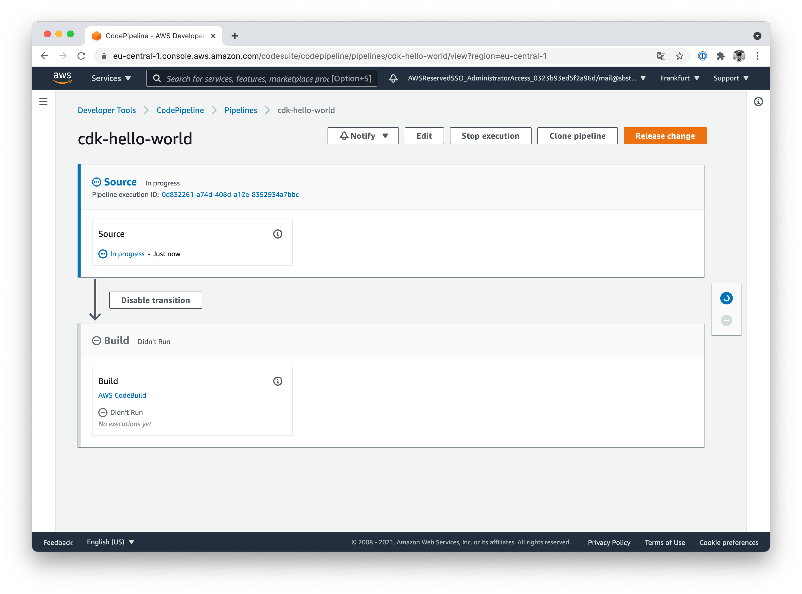